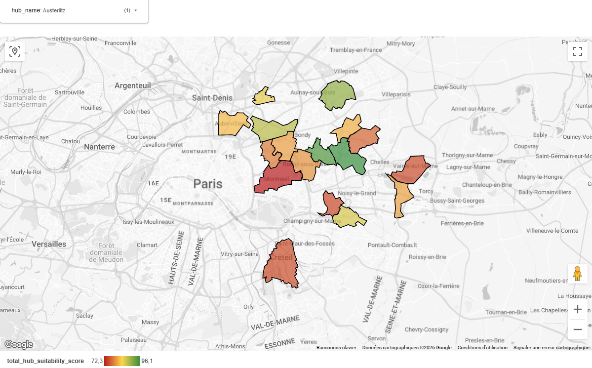
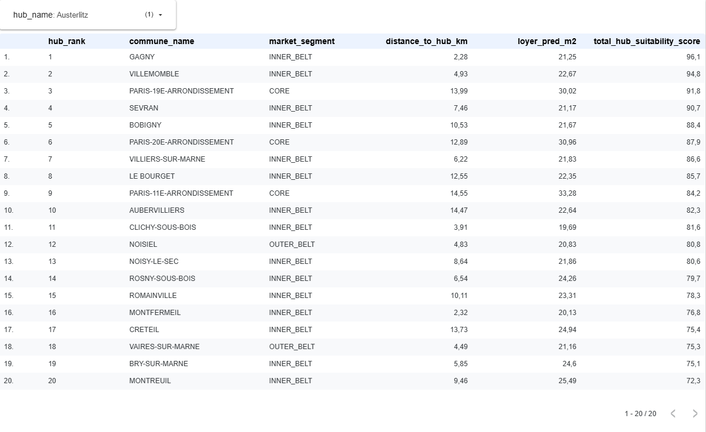
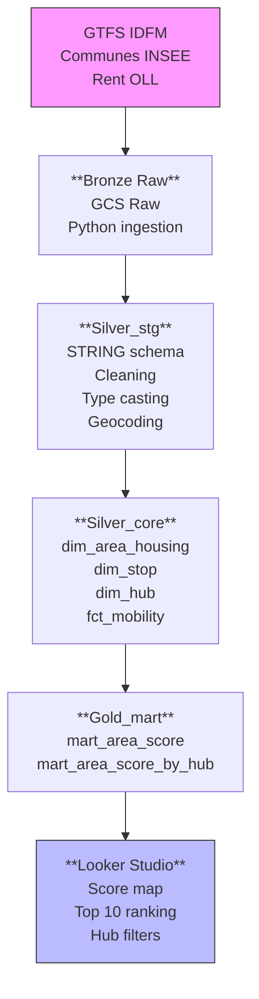

# IDF_optimal_Home2Work
## Data Warehouse Optimizing Residential Choice in Île-de-France 






**Portfolio project showcasing modern Data Engineering skills**: multi‑format ingestion, dimensional modeling, geospatial analytics, business scoring, data quality, dashboarding.

## **Business Objective**
Help employees (persona: engineer working at La Défense, Châtelet, Massy…) identify optimal Île-de-France communes balancing **housing cost + public transport accessibility** (travel time + line types: metro/RER/tram/bus).

## **Technical Architecture**


## **Tech Stack**
| Category      | Tools                                  |
| ------------- | -------------------------------------- |
| Cloud         | GCP (GCS, BigQuery, Terraform)         |
| Ingestion     | Python (pandas, gcsfs, auto‑encoding)  |
| Modeling      | dbt (medallion, dims/facts, DQ tests)  |
| Spatial       | BigQuery GIS (ST_DWITHIN, ST_DISTANCE) |
| Dockerization | Docker                                 |
| Visualization | Looker Studio (map, ranking, filters)  |

## **Data Sources**
| Source        | Content                                 | Granularity                 |
| ------------- | --------------------------------------- | --------------------------- |
| IDFM GTFS     | 40k+ stops, routes (metro/RER/tram/bus) | stop_id, route_type         |
| Communes IDF  | 1.3k communes, centroids                | INSEE code, geo_point       |
| Rent OLL 2025 | Median rent/m² per commune              | commune_code, loyer_pred_m2 |

## **Technical Pipeline**
### 1. Bronze Ingestion (Sources → GCS)

Storing data from various sources, with snapshots being the date of ingest.

### 2. Silver Storage (GCS → BigQuery)

Auto‑encoding detection, flexible STRING schema


### 3. Silver Core (dbt SQL)

Use **dbt** to normalize and process data before building the data warehouse.

### 4.  Gold Mart (business scoring)

Data warehouse, business logic.

### 5. Data Quality (dbt tests)

- unique: commune_code
- not_null_proportion: at_least=0.95, column_name="loyer_pred_m2"
- expression_is_true: "loyer_pred_m2 >= 0 OR loyer_pred_m2 IS NULL"


## **Interactive Dashboard**

I used **Looker Studio** to visualize the optimal living areas for each transport hub.

**Key Features**:

- Heatmap: Identification of high-score communes around Ile-de-France.

- Hub Filter: Instantly switch between Gare de Lyon, Châtelet, etc.

[Locker Studio Dashboard](https://lookerstudio.google.com/reporting/08b7ae5d-f632-4535-b309-fbdad2e60889)


## **Data Engineering Skills Demonstrated**

| Skill                | Implementation                                                |
| -------------------- | ------------------------------------------------------------- |
| Cloud Infrastructure | Terraform (BigQuery datasets, GCS, IAM)                       |
| Complex Ingestion    | Heterogeneous CSV (encoding detection, sep=";"), GTFS parsing |
| Data Modeling        | Medallion + Kimball (dims/facts), dbt macros                  |
| Spatial Analytics    | BigQuery GIS (800m buffer, distance scoring)                  |
| Data Quality         | dbt schema tests + business rules                             |
| Dockerization        | Docker Container  
| Modern Analytics     | Looker Studio + end‑to‑end SQL                                |


## **Dockerization & Portability**

For consistent execution across any environment, the entire data pipeline (Python scripts + dbt) is containerized using **Docker** and managed by **uv** for lightning-fast dependency resolution.

### **1. Container Architecture**
The Docker image encapsulates:
- **Python 3.12-slim** as the base OS.
- **uv** to manage dependencies (google-cloud-storage, dbt-bigquery, etc.).
- A custom **orchestration script** (`run_pipeline.sh`) to ensure sequential execution.

### **2. Build the Pipeline**
```bash
# Build the image
docker build -t idf-data-pipeline .

```

### **3. Run the Full Flow**

The container executes a "Domino Effect" pipeline: `Local → GCS → BigQuery Raw → dbt Build` 

```bash
docker run --rm \
  -v $(pwd)/credentials:/app/credentials \
  idf-data-pipeline

```


## **Local Setup**

(**Note**: U have to create a Google Service Account JSON and ensure it is in the `credentials/` folder.)
<pre>
# 1. Infrastructure
uv run terraform init && terraform apply

# 2. Docker
 - docker build -t idf-data-pipeline .
 - docker run --rm \
  -v $(pwd)/credentials:/app/credentials \
  idf-data-pipeline

</pre>

## **Conclusion & Key Takeaways**

This project serves as a comprehensive demonstration of a **Modern Data Stack** implementation, moving beyond simple SQL queries to a fully orchestrated, production-ready pipeline.

### **Key Achievements:**
* **End-to-End Automation**: Successfully integrated **Terraform** for Infrastructure-as-Code and **Docker** for seamless deployment, ensuring the pipeline is portable and scalable.
* **Advanced Geospatial Analytics**: Leveraged **BigQuery GIS** to solve a real-world problem (optimal housing) by combining transit accessibility with economic constraints.
* **Data Reliability**: Implemented a **Medallion Architecture** coupled with rigorous **dbt testing**, ensuring that every insight on the dashboard is backed by clean, validated data.
* **Efficiency with Modern Tools**: Utilized **uv** for high-speed Python environment management, significantly reducing build times and dependency conflicts.

### **Future Roadmap:**
- [ ] **CI/CD Integration**: Automating the Docker build and Terraform apply via GitHub Actions.
- [ ] **Real-time Updates**: Integrating Cloud Functions to trigger the pipeline whenever IDFM updates their GTFS feeds.
- [ ] **Enhanced Scoring**: Adding social amenities data (schools, parks) to the business scoring logic.

---
**Contact & Portfolio**


## **Resources**
### Dataset: 
- "GTFS IDFM" : https://prim.iledefrance-mobilites.fr/fr/jeux-de-donnees/offre-horaires-tc-gtfs-idfm

*Description data set* : https://eu.ftp.opendatasoft.com/stif/GTFS/GTFS_source_Netex.pdf

- "Commune polygons" https://data.iledefrance.fr/explore/dataset/communes-france/information/?disjunctive.reg_name&disjunctive.dep_name&disjunctive.arrdep_name&disjunctive.ze2020_name&disjunctive.epci_name&disjunctive.ept_name&disjunctive.com_name&disjunctive.ze2010_name&disjunctive.com_is_mountain_area&disjunctive.bv2022_name&sort=year

- Apartment rental prices by commune (2025) 1-2 pieces: https://www.data.gouv.fr/datasets/carte-des-loyers-indicateurs-de-loyers-dannonce-par-commune-en-2025


Date: 17 March 2026
